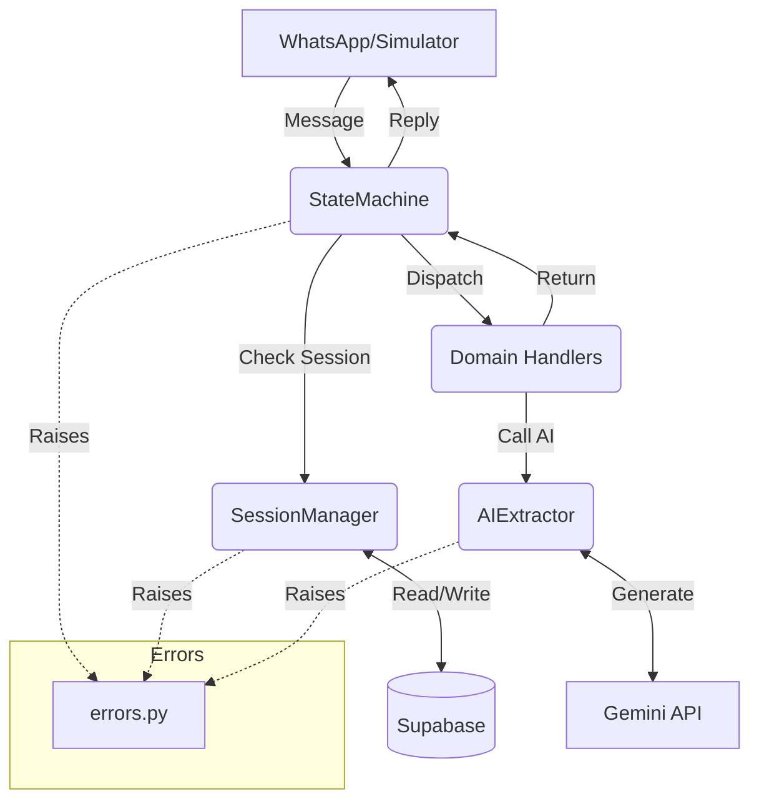

# Technical Design: wa_toolkit

**Status**: Draft
**Version**: 1.0.0
**Author**: Replate Engineering

## 1. Objective
To provide a reusable, modular Python framework for building multi-turn WhatsApp chatbots. The toolkit abstracts the "plumbing" (session persistence, state routing, AI extraction, and local simulation) so developers can focus exclusively on conversation logic and domain-specific actions.

## 2. System Architecture



## 3. Core Components

### 3.0 Package Structure
The toolkit is organized as a modular Python package:

```text
wa_toolkit/
├── __init__.py        # Package entry point
├── session.py         # SessionManager (Supabase persistence)
├── state_machine.py   # StateMachine (Orchestration & Dispatch)
├── ai_extractor.py    # AIExtractor (Gemini with resilience)
├── simulator.py       # Simulator (Local REPL)
└── errors.py          # Exception hierarchy
```

### 3.1 SessionManager (`session.py`)
**Base Class**: `SessionManager`
Responsible for persistence. It assumes a specific PostgreSQL schema in Supabase but allows for a custom table name.

**Implementation Details:**
- **Storage**: Supabase `JSONB` for `temp_data` to allow arbitrary key-value storage per project.
- **Consistency**: To prevent inconsistent states during process failures, the toolkit MUST perform a single write operation when updating both state and data.
- **Methods**:
    - `get(phone)`: Returns a `dict` representing the session.
    - `create(phone, state)`: Initializes a session using `.upsert()`.
    - `update(phone, state, data)`: Persists both `state` and `temp_data` in a single `.update()` call to ensure transactional consistency. (Partial update methods for state or data only are NOT exposed).
    - `delete(phone)`: Removes the session from the database.

### 3.2 StateMachine (`state_machine.py`)
**Base Class**: `StateMachine`
The orchestrator. It manages the lifecycle of a message from arrival to reply.

**Key Features:**
- **Command Interception**: Intercepts "system" commands (`RESET`, `STOP`, `NEW`) before they reach domain handlers.
- **Robust Error Handling**: Wraps handler execution in `try/except` to prevent bot crashes.
- **V1 Media Readiness**: The `handle(phone, message)` signature accepts `Any` for the message to remain forward-compatible with future V2 rich-media objects.
- **Validation**: During the dispatch phase, if the current session state has no registered handler, the `StateMachine` MUST raise a `StateNotFoundError`.

### 3.3 AIExtractor (`ai_extractor.py`)
**Base Class**: `AIExtractor`
A wrapper around the Google GenAI SDK (Gemini) with built-in resilience.

**Robustness Strategy:**
- **Exponential Backoff**: 5 retries starting at 4s.
- **Model Fallback**: Automatically switches from `gemini-flash-latest` to `gemini-flash-lite-latest` on failure.
- **Offline Mode**: If `MOCK_AI=true`, it skips the API and calls a project-provided `mock_fn`.

### 3.4 Simulator (`simulator.py`)
A REPL-based interface for rapid local testing.

**API Compatibility**: The `run()` method accepts a handler function with the signature `(phone: str, message: Any) -> str`, ensuring full compatibility with the `StateMachine.handle` method.

## 4. Error Handling & Exceptions (`errors.py`)
The toolkit defines a hierarchy of exceptions:

- `WAToolkitError`: Base class.
- `AIExtractionError`: Failed after all retries and fallbacks.
- `SessionError`: Database connection or schema mismatch issues.
- `StateNotFoundError`: Raised by `StateMachine` if it attempts to dispatch to a state with no registered handler.

## 5. Configuration & Environment
The toolkit relies on the following environment variables. Host applications are responsible for loading these (e.g., via `python-dotenv`) before initializing toolkit components.

| Variable | Required | Description |
|---|---|---|
| `SUPABASE_URL` | Yes | Project URL for database persistence. |
| `SUPABASE_SERVICE_ROLE_KEY` | Yes | Service key to bypass RLS for session management. |
| `GEMINI_API_KEY` | Yes | API key for LLM extraction logic. |
| `MOCK_AI` | No | If "true", enables offline mode for `AIExtractor`. |

## 6. Engineering Standards (Requirements)

### 6.1 Logging Strategy
The toolkit MUST NOT use `print()` statements. It will use a named Python logger:
- **Logger Name**: `wa_toolkit`
- **Standard**: Host applications can control verbosity via `logging.getLogger("wa_toolkit").setLevel()`.
- **Key Events**: AI retry attempts, session write failures, and command interceptions MUST be logged at `INFO` or `WARNING` levels.

### 6.2 Handler Interface Specification
Domain handlers registered with the `StateMachine` MUST adhere to the following contract:
- **Input**: `(phone: str, message: Any, data: dict)`
- **Output**: `tuple[str, str, dict]` -> `(reply_text, next_state, updated_data)`
- **No-Op Logic**: If a handler makes no changes to the data, it should return the original `data` object to avoid redundant DB writes.

### 6.3 Dependency Management
The toolkit implementation MUST include a `requirements.txt` that pins the following core dependencies to specific versions to prevent breaking changes in host projects:
- `supabase == 2.11.0` (or latest stable)
- `google-genai == 1.2.0`
- `tenacity == 9.0.0`

### 6.4 Graceful Degradation
Failed AI extractions MUST NOT raise unhandled exceptions to the `StateMachine`. Instead, the `AIExtractor` must return a valid JSON object with a project-defined flag (e.g., `requires_review: true`) indicating that human intervention is needed.

## 7. Testing Strategy

The toolkit itself must be validated independently of the projects using it:

1.  **Unit Tests (`StateMachine`)**: Verify command interception and handler routing using mock handlers and a mock SessionManager.
2.  **Mock Integration (`SessionManager`)**: Test session CRUD operations against a mock Supabase client to ensure single-write consistency.
3.  **Resilience Tests (`AIExtractor`)**: Force API failures to verify that exponential backoff and model fallback trigger correctly.
4.  **REPL Verification**: Ensure the simulator correctly terminates on `EXIT` and handles `KeyboardInterrupt`.

## 8. Roadmap / V2

- **Rich Media**: Implementation of a `Message` object to parse image URLs and voice notes.
- **Provider Agnostic**: Support for Twilio and Meta Cloud API through a unified `MessageAdapter`.
- **Storage Adapters**: Interface-based persistence to support Redis or In-Memory storage.
